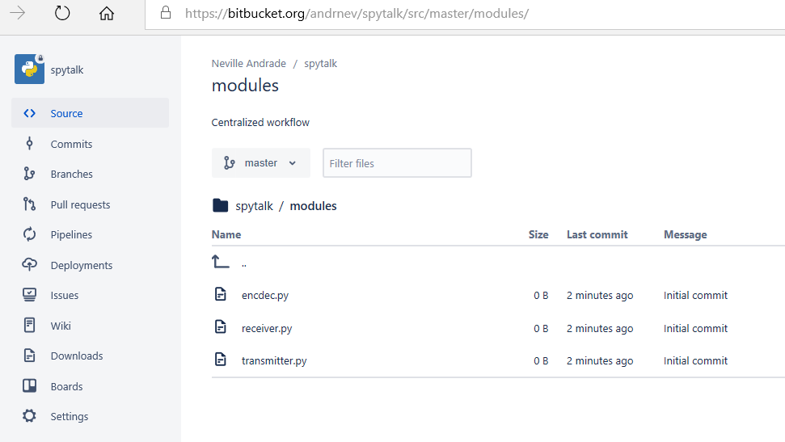

# JIRA and Trello integration

Setting up Jira thru Bitbucket is quite easy too. Once you have a bitbucket accounton the left corner you get a function to try out the JIRA software

A few more settings are required

