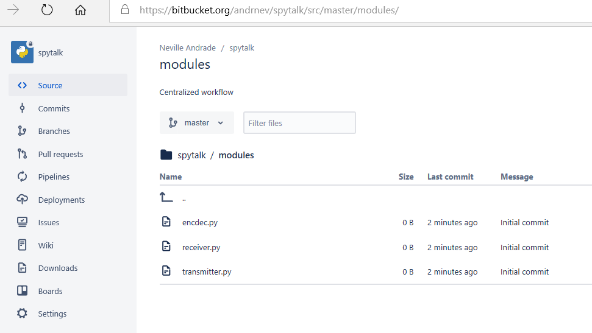

# Centralized workflow

As mentioned in the last chapter the centralized workflow is best used in individual or small team research projects to collaborate and enhance

* Best used for small teams \(5 to 10\) transitioning from SVN to Git.
* Ideal use case for research projects involving one or max 3 members
* All members work on a single master branch and not branches of the master
* Best for maintaining documentation

Before we run thru an example, how would you know if the centralized workflow is for you and your team? You need to answer a "yes" for 3 basic questions. If "no" for any one of these questions, then the centralized workflow is not the best option.

The questions

1. Is your team expected to remain small i.e. maximum 10 users in the future?
2. Can errors be easily corrected?
3. Will the team need to learn very little to get things up and running?

Let me now give an example. 

The setup is a research project called "Spy talk". The project name is a dead give away of what the company funding that project deals in. The company specialises in, lets say, providing spy solutions to governments who can pay the price. Two brilliant and highly skilled researchers Neville and Rosa are working on the project. Neville and Rosa are both electronics and communication specialists and have worked on many military projects together. Neville is the project lead and maintains the remote repository located on a bitbucket server.

The project has 3 modules and a documentation section. 

1. The Transmitter module \(maintained by Neville\)
2. The Receiver module \(maintained by Rosa\)
3. The Encoder Decoder module \(maintained by Neville and Rosa\)
4. Documentation \(maintained by Neville and Rosa\)

Now here you can see that Neville and Rosa work independently on two modules each but collaborate with each other on one of the modules and also on the documentation.

Lets have a look at the project structure on the bitbucket server.

 

